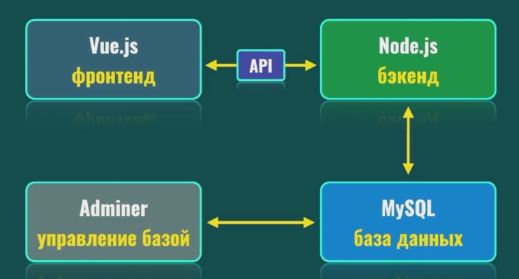

# What is it
It's an example docker project. Here you can see all the basic features of docker usage. 

# Architecture


# Usage
```powershell
docker-compose up
```
## Frontend
follow localhost:3000

## DBAdminer
follow localhost:8888

# Features
You can try to edit any files in frontend or api directories. 
They will be updated inside the container.